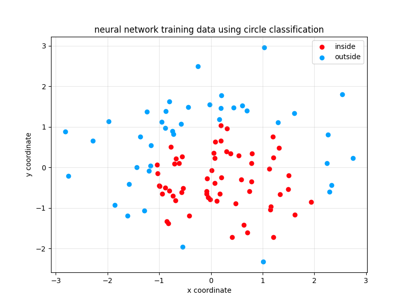

# Circle Classification Neural Network

A neural network built from scratch to learn whether random points fall inside or outside a circle - demonstrating how neural networks can learn non-linear decision boundaries.

## The Problem

- **Dataset**: 100 random 2D points scattered around coordinate space
- **Challenge**: Classify points as inside or outside a specific circle
- **Goal**: Build a neural network from scratch that learns the circular boundary without hardcoding the math

## The Solution

**Architecture**: Input(2) → Hidden(4, ReLU) → Output(1, Sigmoid)

### Circle Parameters

- **Center**: (0.5, -0.5)
- **Radius**: 1.6546
- **Classification**: 0 = inside (red), 1 = outside (blue)

## What Makes This Interesting

**Non-linear Problem**: A straight line can't separate points inside/outside a circle. The neural network must learn to approximate the distance formula:

```
distance = √[(x - 0.5)² + (y + 0.5)²]
```

classify as inside if distance ≤ radius

## Results

- **Initial Cost**: Printed to show starting error before learning
- **Visualization**: Scatter plot with red (inside) and blue (outside) points
- **Learning**: One gradient descent step demonstrates weight updates

## Example Output



---

Built as part of learning neural networks from scratch! 🧠
